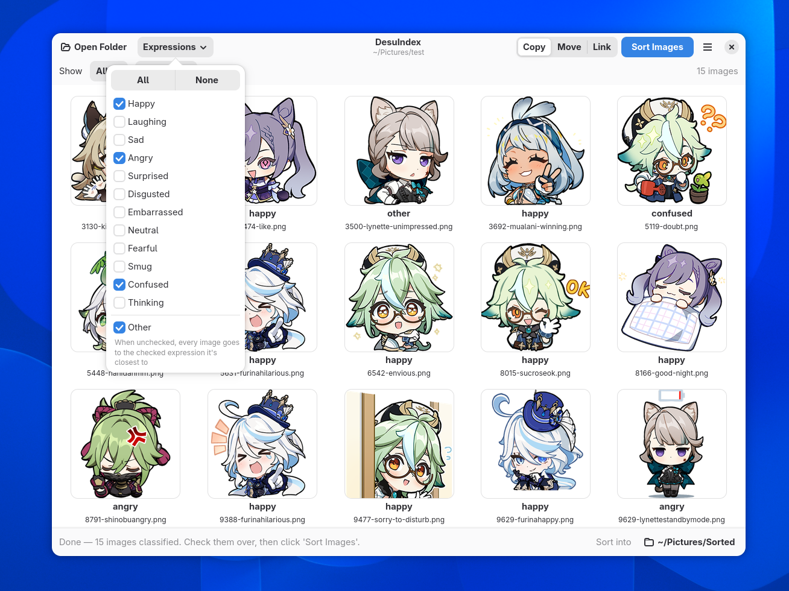
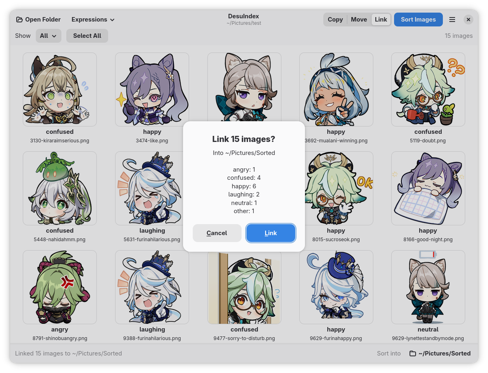
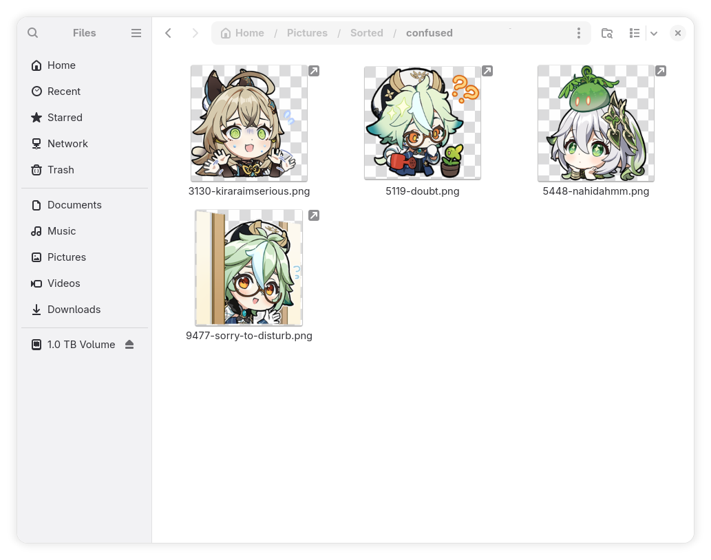

# DesuIndex

DesuIndex is a simple enough Flatpak program for easily organizing your anime reaction images written to look as sleek and cohesive as possible under GNOME for GNU/Linux.


## How to use

All you have to do is just open the folder you want to sort and it'll tag whatever is put in. The images are tagged by most likely probability and when certain expressions are unchecked the images will then be sorted to whichever is most probable in the list. 



The images will be copied, moved or symlinked to `~/Pictures/Sorted/` by default once the user presses "Sort Images" but can be changed to wherever. 





## Permissions

Everything runs locally on the system. Network access is enabled to download the model from Hugging Face on first launch and can be disabled through the CLI or Flatseal after if desired. 

By default only has access to `~/Pictures` but you can open any folder through the file picker.

## How good is it?

Pretty solid, it's good enough to generally sort what you need and fast enough in the GUI to move around the errors it makes. I'm thinking about trying out different models in the future to be more lightweight and faster. At the moment scanning a thousand images takes about thirty minutes on an AMD Ryzen 7 7700 CPU.

## Other things to know

Unchecking "Other" will stop placing images into that folder and instead try to associate it with whatever other reactions were picked.

Preferences menu has the option to search subfolders along with remembering sorted images to prevent redundant scans on the next scan. Both of these options are disabled by default.

If "Remember Sorted Images" for files is turned off re-scanning a directory and creating symlinks or copying will create duplicates in folders since it cannot reference past scans.

## Install

DesuIndex isn't currently on any app stores (hopefully in the future) but you can download the Flatpak from the [latest release](https://github.com/hexvi/DesuIndex/releases/latest), then:

```bash
flatpak install --user DesuIndex.flatpak
flatpak run io.github.hexvi.DesuIndex 
```

You can also build it yourself with:

```bash
sudo dnf install flatpak-builder     # Ubuntu/Debian: sudo apt install flatpak flatpak-builder
./build-flatpak.sh                   # builds and installs for your user
flatpak run io.github.hexvi.DesuIndex
```

`./build-flatpak.sh --bundle` builds a single `.flatpak` file instead, for
installing on another computer with `flatpak install --user <file>`.

## License

DesuIndex is licensed under the GNU General Public License v3.0 or later; see
[LICENSE](LICENSE). The tagger model is by SmilingWolf and licensed under
Apache-2.0.
